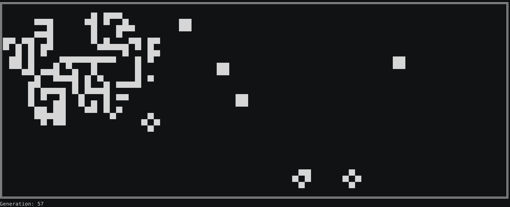

[](http://travis-ci.org/binaryplease/go-game-of-life) [](http://godoc.org/github.com/binaryplease/go-game-of-life)
[](https://goreportcard.com/report/github.com/binaryplease/go-game-of-life)
[](https://codecov.io/gh/binaryplease/go-game-of-life)


# Conway's Game of Life
From [Wikipedia](https://en.wikipedia.org/wiki/Conway%27s_Game_of_Life), the free encyclopedia:

> The Game of Life, also known simply as Life, is a cellular automaton devised by
> the British mathematician [John Horton Conway](https://en.wikipedia.org/wiki/John_Horton_Conway) 
> in [1970](https://en.wikipedia.org/wiki/Conway%27s_Game_of_Life#cite_note-1).
> The game is a [zero-player game](https://en.wikipedia.org/wiki/Zero-player_game),
> meaning that its evolution is determined by its initial state, requiring
> no further input. One interacts with the Game of Life by creating an initial
> configuration and observing how it evolves, or, for advanced players, by
> creating patterns with particular properties



This a go implementation of Conway's Game of Life. It allow to specify the size
of the size of the starting grid, aswell as the precentage of living cells at
the start. The grid is displayed using ascii.


The evolution of the cells follows this four simple rules:
1. Any live cell with fewer than two live neighbors dies, as if by underpopulation.
2. Any live cell with two or three live neighbors lives on to the next generation.
3. Any live cell with more than three live neighbors dies, as if by overpopulation.
4. Any dead cell with exactly three live neighbors becomes a live cell, as if by reproduction.

## Install

TODO

## Usage
You can pass the following parameters to the executable, all of them are
optional and will use a default, if ommitted.

```
usage: game-of-life [<flags>]

Flags:
      --help           Show context-sensitive help (also try --help-long and --help-man).
  -x, --xsize=80       The width of the grid
  -y, --ysize=15       The height of the grid
  -i, --iterations=-1  Number of iterations. Any negative number will use the default, infinity
  -f, --fps=25         Frames per second, how log to wait until the next iteration is displayed
  -p, --percentage=35  Percentage of living cells at the start
      --version        Show application version.

```

## This Software
I implemented this as an excercise to explore go's testing package, travis-ci
and some other of go's features. It probably has no real-world applications, but
is nice to watch for a while. 

You may fork, modify, copy, distribute, watch it for hours or do whatever you want with it. Have
fun!

## Contributing
Pull-requests, issues, comments and other improvements are very welcome!

